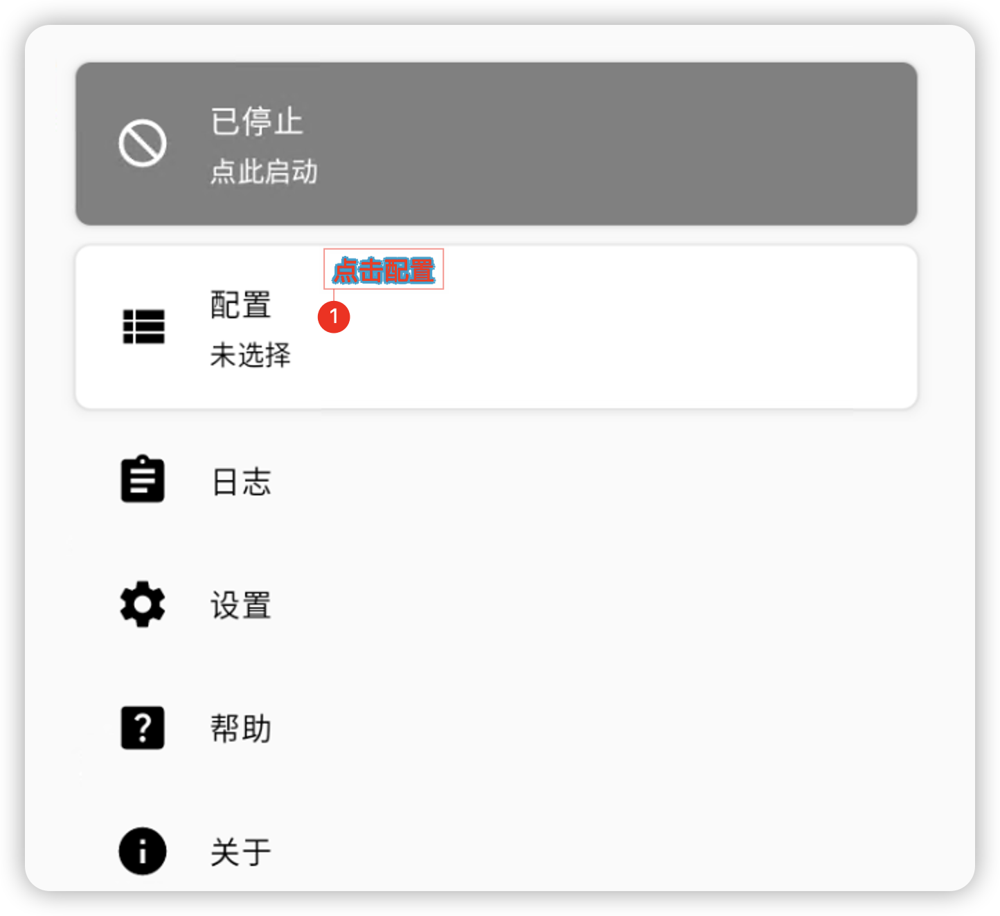
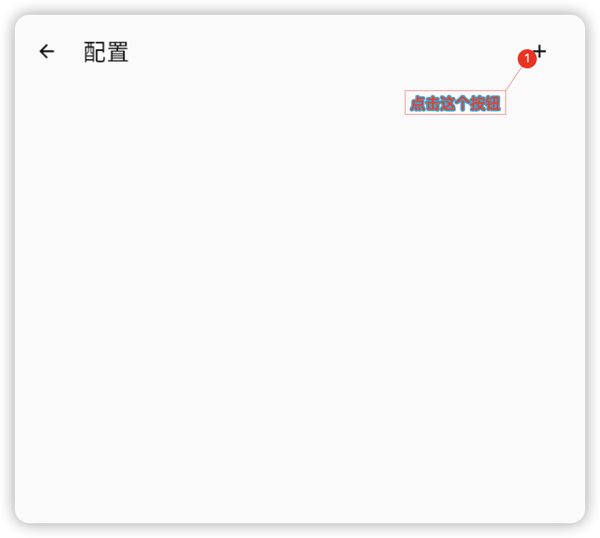
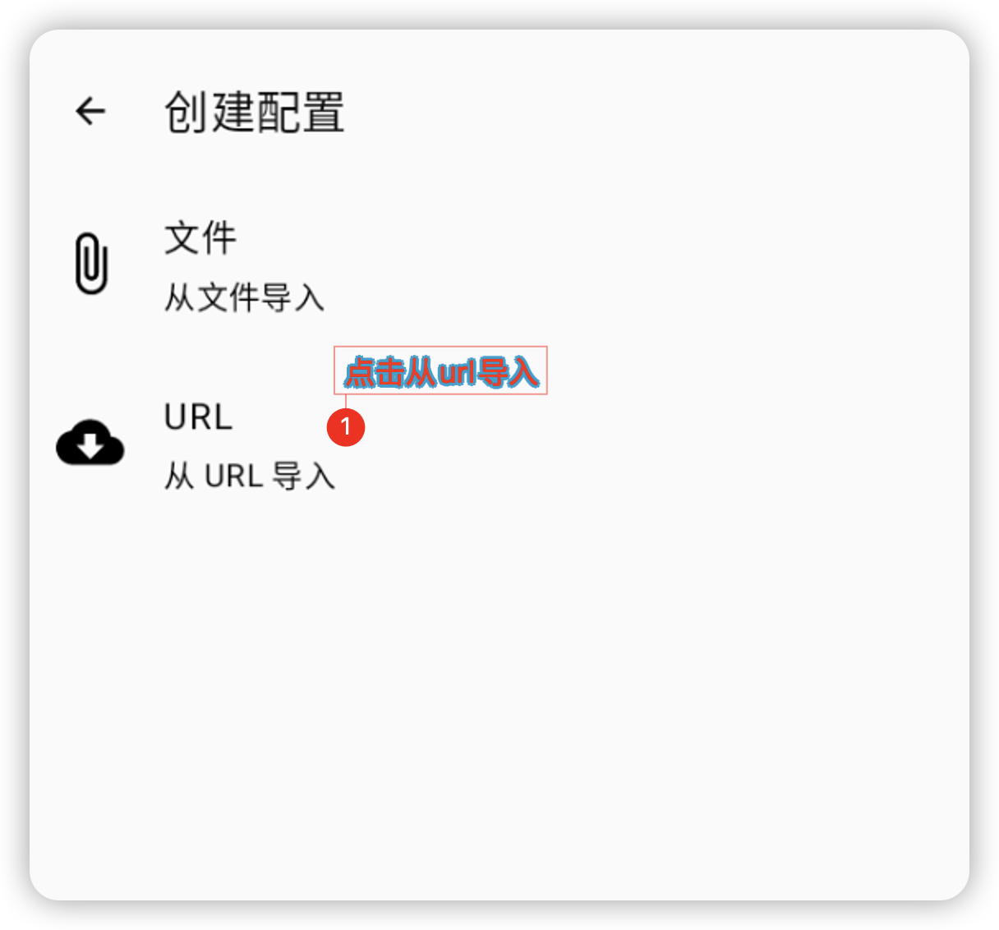
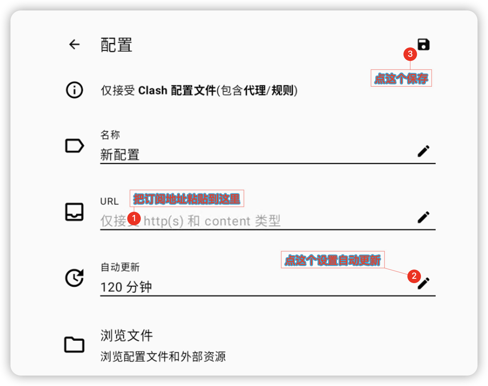
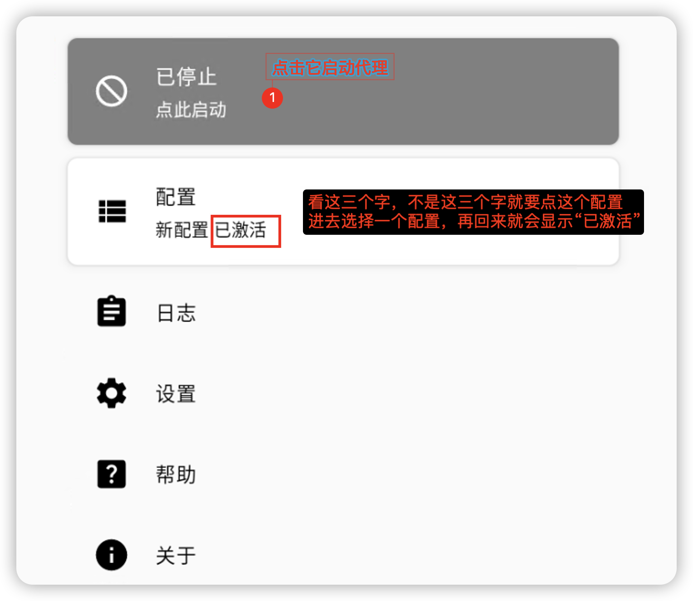
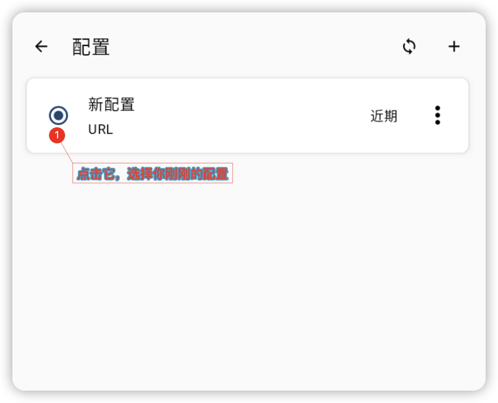
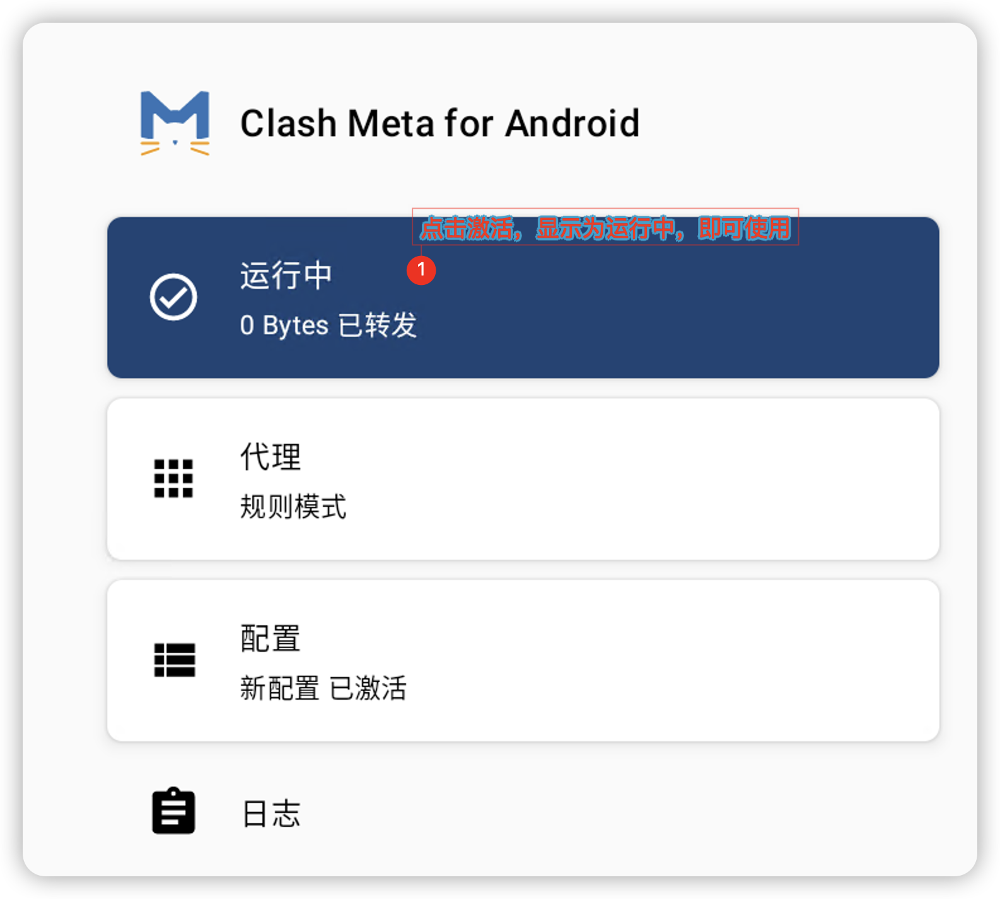

### 使用教程
本教程针对 `Android/Harmony(安卓/鸿蒙操作系统)`

#### 一、获取客户端
有二种方法获取客户端
- 在 `tg频道` [sassvpn](https://t.me/sassvpn) 中获取
- 在官方 [ClashMetaForAndroid](https://github.com/MetaCubeX/ClashMetaForAndroid/releases) 获取
  - 推荐下载 `alpha-universal-release.apk` 版本

#### 二、配置客户端
- 把订阅地址复制之后按下图中所示使用

- 新增配置

- 创建配置订阅

- 配置订阅。推荐在此处设置自动更新时间，避免出现无法使用的情况（也可以手动更新）

- 回到软件首页，查看配置是否已激活

- 如果没有激活，点击配置，进去选择 `新配置` 的这个选项

- 再回到首页，点击启动

#### 三、已知问题：
- 暂无，欢迎反馈
