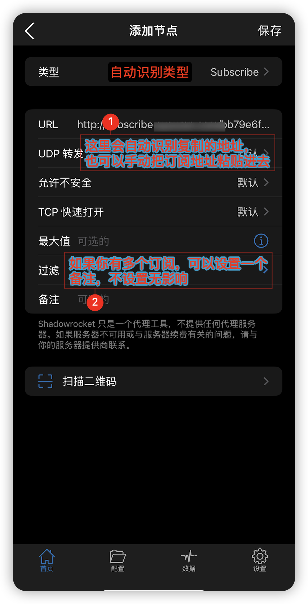

### 使用教程
本教程针对 `Ios(苹果手机/Ipad)`

#### 一、获取客户端
有二种方法获取客户端
- 在 `tg频道` [sassvpn](https://t.me/sassvpn) 中获取
- 在苹果设备中找到`App Store`
  - 右上角找到你的头像
  
  - 退出你的账户
  
  - 登录 `美区 Apple ID`
  
  - 搜索 `Shadowrocket` 下载
  

#### 二、配置客户端
- 把订阅地址复制之后按下图中所示使用

- 自动识别订阅地址

- 使用

#### 三、已知问题：
- 暂无，欢迎反馈