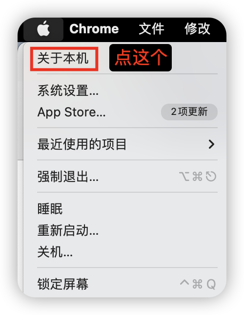

# `Mac(苹果电脑)`使用教程

这里提供`2`种最流行的客户端教程（任选其一即可，推荐使用第一种）
## 一、[mihomo-party](https://github.com/mihomo-party-org/mihomo-party/releases) 使用教程
### 1、获取客户端
在 [mihomo-party](https://github.com/mihomo-party-org/mihomo-party/releases) 官方发布页下载
- 操作系统是 `macOS 10.15+` 
  - 下载带 `catalina` 的 `x64.pkg` 版本
- 操作系统是 `macOS 11+` 
  - `cpu` 是`英特尔芯片(Intel)`，下载`x64.pkg` 版本
  - `cpu` 是`苹果(Apple Silicon)`，下载`arm64.pkg` 版本
- 

### 2、配置客户端
- 把订阅地址复制之后按下图中所示使用

## 二、[Clash.Verge](https://github.com/clash-verge-rev/clash-verge-rev/releases) 使用教程
### 1、获取客户端

在 [Clash.Verge](https://github.com/clash-verge-rev/clash-verge-rev/releases) 官方发布页下载

- `cpu` 是`英特尔芯片(Intel)`，下载`x64.dmg` 版本
- `cpu` 是`苹果(Apple Silicon)`，下载`aarch64.dmg` 版本
- 

### 2、配置客户端
- 把订阅地址复制之后按下图中所示使用

- 在软件中开启代理功能

# 已知问题：
- 如何查看自己的 `mac` 电脑的操作系统和芯片厂商
  - 右上角`苹果图标` -> `关于本机` 
  - 
  - 