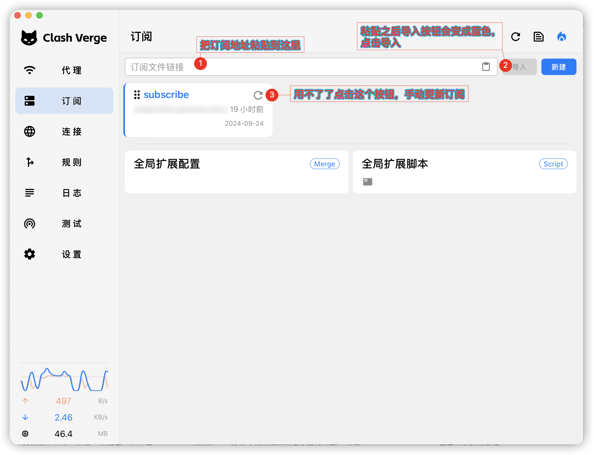
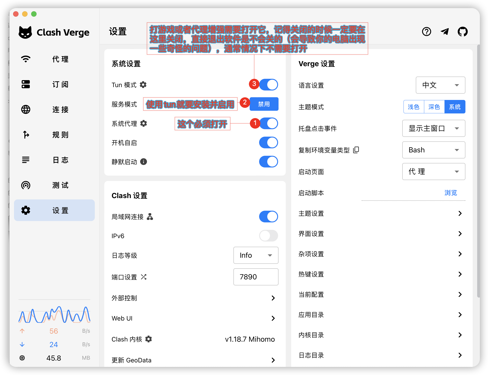

# `Windows(微软操作系统)`使用教程

这里提供`2`种最流行的客户端教程（任选其一即可）
## 一、[mihomo-party](https://github.com/mihomo-party-org/mihomo-party/releases) 使用教程

## 二、[Clash.Verge](https://github.com/clash-verge-rev/clash-verge-rev/releases) 使用教程
### 1、获取客户端
有二种方法获取客户端
- 在 `tg频道` [sassvpn](https://t.me/sassvpn) 中获取
- 在官方 [Clash.Verge](https://github.com/clash-verge-rev/clash-verge-rev/releases) 获取
  - 推荐下载 `x64-setup.exe` 版本

### 2、配置客户端
- 把订阅地址复制之后按下图中所示使用

- 在软件中开启代理功能

## 已知问题：
- 暂无，欢迎反馈