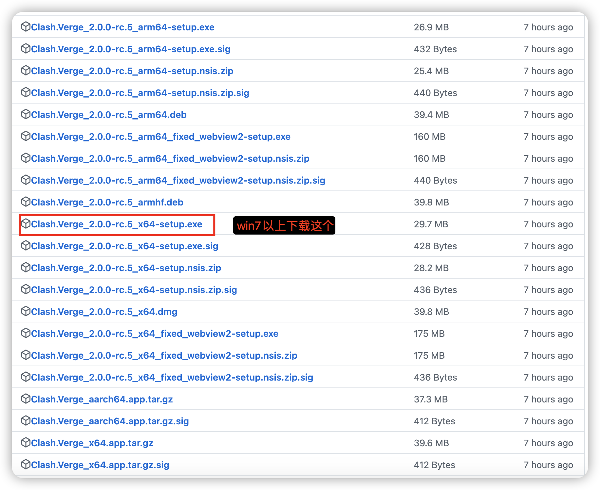

# `Windows(微软操作系统)`使用教程

这里提供`2`种最流行的客户端教程（任选其一即可，推荐使用第一种）
## 一、[mihomo-party](https://github.com/mihomo-party-org/mihomo-party/releases) 使用教程
### 1、获取客户端
在 [mihomo-party](https://github.com/mihomo-party-org/mihomo-party/releases) 官方发布页下载
- 系统是`win7` 推荐下载带 `win7` 的 `x64-setup.exe` 版本
- 系统是`win8～11` 推荐下载`x64-setup.exe` 版本
- 

### 2、配置客户端
- 把订阅地址复制之后按下图中所示使用
  

## 二、[Clash.Verge](https://github.com/clash-verge-rev/clash-verge-rev/releases) 使用教程
### 1、获取客户端

在 [Clash.Verge](https://github.com/clash-verge-rev/clash-verge-rev/releases) 官方发布页下载

#### 请注意 `win7` 不要使用这个，官方虽然给出了方案，但是不推荐使用，除非你想自己折腾
- 推荐下载 `x64-setup.exe` 版本
- 

### 2、配置客户端
- 把订阅地址复制之后按下图中所示使用
- 
- 在软件中开启代理功能
- 

## 已知问题：
- 暂无，欢迎反馈